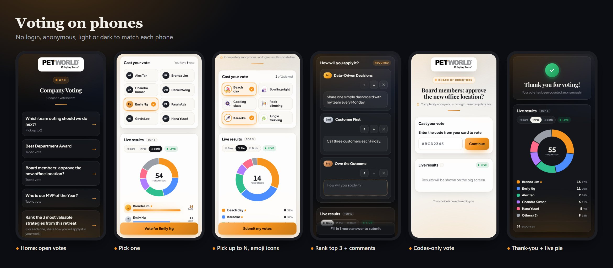
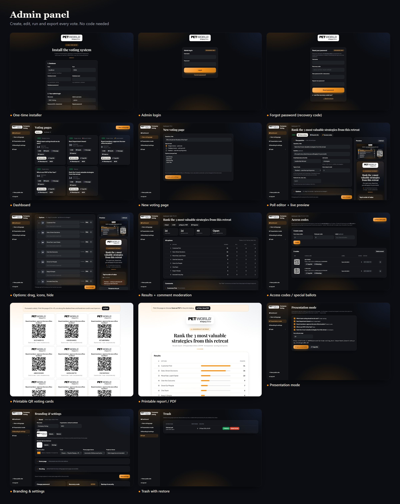

# WKC Voting System

Live, anonymous voting for events. Phones vote with no login, a projector shows the results live, and you run everything from an admin panel. It's built with PHP + MySQL so it runs on standard cPanel hosting.

| Folder | What it is |
|---|---|
| `platform/` | **The voting platform** (v1.0.0), the thing you install on cPanel. |
| `DEPLOY-CPANEL.md` | Step-by-step cPanel install guide (about 15 minutes). |
| `PLAN.md` | The original plan and phase status. |
| `events/` | The original FY27 Retreat votes (Node.js), kept exactly as they ran. |
| `dist/` | Built release zips (not in git). Build one with `php platform/tools/build_release.php`. |

## Screenshots

Captured from a demo install with made-up names and votes.

### Voting on phones


### Projector (big screen)


### Admin panel


<details><summary>Full-size individual screenshots</summary>

**Phones:** [home](docs/screenshots/phone-01-home.jpg) · [vote](docs/screenshots/phone-02-vote.jpg) · [multi emoji](docs/screenshots/phone-03-multi-emoji.jpg) · [ranked comments](docs/screenshots/phone-04-ranked-comments.jpg) · [access code](docs/screenshots/phone-05-access-code.jpg) · [thanks pie](docs/screenshots/phone-06-thanks-pie.jpg)

**Projector:** [bars](docs/screenshots/screen-01-bars.jpg) · [pie](docs/screenshots/screen-02-pie.jpg) · [both](docs/screenshots/screen-03-both.jpg) · [reveal waiting](docs/screenshots/screen-04-reveal-waiting.jpg) · [ranked](docs/screenshots/screen-05-ranked.jpg) · [answers wall](docs/screenshots/screen-06-answers-wall.jpg) · [emoji pie](docs/screenshots/screen-07-emoji-pie.jpg)

**Admin:** [installer](docs/screenshots/admin-01-installer.jpg) · [login](docs/screenshots/admin-02-login.jpg) · [forgot](docs/screenshots/admin-03-forgot.jpg) · [dashboard](docs/screenshots/admin-04-dashboard.jpg) · [new poll](docs/screenshots/admin-05-new-poll.jpg) · [editor](docs/screenshots/admin-06-editor.jpg) · [editor options](docs/screenshots/admin-07-editor-options.jpg) · [results](docs/screenshots/admin-08-results.jpg) · [access codes](docs/screenshots/admin-09-access-codes.jpg) · [qr cards](docs/screenshots/admin-10-qr-cards.jpg) · [report](docs/screenshots/admin-11-report.jpg) · [presentation](docs/screenshots/admin-12-presentation.jpg) · [settings](docs/screenshots/admin-13-settings.jpg) · [trash](docs/screenshots/admin-14-trash.jpg)

</details>

To regenerate after design changes: run a fresh install on an empty database, then `node docs/screenshots/capture.mjs http://127.0.0.1:18996`.

## What the platform does

- **Voting pages you manage:** create, edit, duplicate, archive, delete (Trash with restore). Every text, the logo, favicon, colours, fonts and each option's icon (initials, emoji or photo) are editable in the admin panel.
- **Three vote types:**
  - **Single choice**, e.g. Most Inspiring Leader.
  - **Multiple choice** (pick up to N).
  - **Ranked** (top N with custom points; ties broken by more 1st places), e.g. Top 3 Strategies.
- **Comments:** off, optional or required per pick, with your own question text.
- **One vote per device by default.** **Access codes** give chosen people extra votes (like the FY27 3-vote links), or you can print **QR cards** and make a poll codes-only.
- **Projector page:**
  - top N on one screen, as **bars, pie chart or both**, switchable live
  - medals, rows sliding up live, and a QR code on screen
  - countdowns and scheduled open/close
  - **reveal mode** (hide results, then reveal 5th → 1st with a drum-roll)
  - an answers wall below, with one-click moderation
- **Presentation mode:** one projector tab rotates through several polls.
- **Exports:** CSV, Excel, a printable report / PDF, and a full backup zip.
- **Security and anonymity:**
  - ballots are never linked to a device
  - admin passwords are hashed, with CSRF protection and login rate limiting
  - private files are blocked by `.htaccess`
  - uploads are checked to be real images
- **Updates install themselves:** database upgrades run automatically, and open pages reload when new files are uploaded.

## Run it on this PC

1. Start MySQL. XAMPP's MariaDB works.
2. Start the dev server:
   ```bash
   C:/xampp/php/php.exe -S localhost:8995 -t platform platform/router.php
   ```
3. Open http://localhost:8995. The installer runs the first time. Your local admin login is in `LOCAL-CREDENTIALS.md` (not in git).

## Test it

```bash
ADMIN_USER=admin ADMIN_PASS='…' BASE=http://localhost:8995 bash platform/tools/smoke_test.sh
```

That runs 41 end-to-end checks: votes, codes, ranked points, reveal, exports, trash and security. It passes on the PHP dev server, under Apache in a subfolder, and on a fresh install from the release zip.
